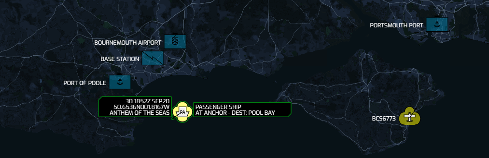

# Plane/Sailing

*The home situational awareness display nobody wanted or needed!*

{: .center}

### What is it?

A completely unnecessary military situational awareness display for your home. It shows the location of nearby aircraft and ships in real time. It does this by pulling ADS-B data in JSON format from a Dump1090 server and AIS from AIS Repeater's KML snapshots. It then shows them overlaid on a map using NATO symbology.

This was a weekend project, the code quality here is a very hacky layer on top of the already dubious code for [UMID 1090](https://github.com/ianrenton/umid1090). Contributions are welcome.

### Why is it?

I spent too much time thinking about whether I *could*, and not enough time thinking about whether I *should*.

### Who is it for?

No idea. Ex-military hams who can't leave the SIGINT life behind? Turbo nerds with a hard-on for MIL-STD 2525 symbology? Anyone with a family tolerant enough to let them wall-mount a huge telly and make their kitchen look like Apollo Mission Control?

### This seems like a lot of work just for a "plain sailing" pun

Blame [@elderlygoose](https://twitter.com/ElderlyGoose)

### Can I see what it looks like?

You can see it running, showing live data from my ADS-B and AIS receivers, at https://planesailing.ianrenton.com.

### What's the hardware behind it?

You can check out the hardware and build guide at https://ianrenton.com/hardware/planesailing/.

### Can I run my own version?

My code in this project is subject to "The Unlicence", i.e. it's public domain and you can do what you want with it.

If you want to use this for yourself, go right ahead. There are some static variables at the top of code.js that you will need to tweak to match your install; you also need your own Mapbox API key in order to get the map background working properly.

Note that this repository only provides the web-based user interface, and so is only part of the whole system. If you want to recreate the whole thing for yourself, you will need to point it at web interfaces of ADS-B and AIS data servers you provide, connected to radio receivers and antennas you provide. It's not pulling data from sites with global coverage APIs like FlightRadar24 or MarineTraffic.

### Future Plans

1. APRS?
2. Whatever else I can pick up with the ever expanding set of Raspberry Pis and RTL-SDR dongles on my desk
