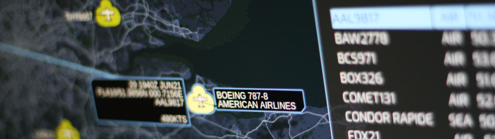

# Plane✈/Sailing⛵

*The home situational awareness display nobody wanted or needed!*

### What is it?

A completely unnecessary military situational awareness display for your home. It shows the location of nearby aircraft and ships in real time, using NATO symbology overlaid on a map.

This project contains the client, which runs in a web browser. For a fully functioning Plane/Sailing system, the [server](https://github.com/ianrenton/planesailing-server) is also required, as are third-party applications such as Dump1090, rtl_ais & Direwolf, and a number of radio receivers. You can check out the full build guide for the system [here](https://ianrenton.com/hardware/planesailing/).

### Why is it?

I spent too much time thinking about whether I *could*, and not enough time thinking about whether I *should*.

### Who is it for?

No idea. Ex-military hams who can't leave the SIGINT life behind? Turbo nerds with a hard-on for MIL-STD 2525 symbology? Anyone with a family tolerant enough to let them wall-mount a huge telly and make their kitchen look like Apollo Mission Control?

### This seems like a lot of work just for a "plain sailing" pun

Blame [@elderlygoose](https://twitter.com/ElderlyGoose)

### Can I see what it looks like?

You can see it running, showing live data from my ADS-B, AIS and APRS receivers, at https://planesailing.ianrenton.com.

### What's the hardware behind it?

You can check out the hardware and build guide at https://ianrenton.com/hardware/planesailing/.

### Can I run my own version?

My code in this project is subject to "The Unlicence", i.e. it's public domain and you can do what you want with it.

If you want to use this for yourself, go right ahead. There are some static variables at the top of code.js that you will need to tweak to match your install, in particular the URL of the Plane/Sailing server that it should talk to.

Note that this repository only provides the web-based user interface, and so is only part of the whole system. If you want to recreate the whole thing for yourself, you will need to set up the [server](https://github.com/ianrenton/planesailing-server) so the client has something to talk to, and set up other ADS-B, AIS and/or APRS decoding applications, and provide radio receivers and antennas. Plane/Sailing is not pulling data from sites with global coverage APIs like FlightRadar24 or MarineTraffic. Check out the [build guide](https://ianrenton.com/hardware/planesailing/) for more information.

### Can I contribute?

Sure. Pull request away!
